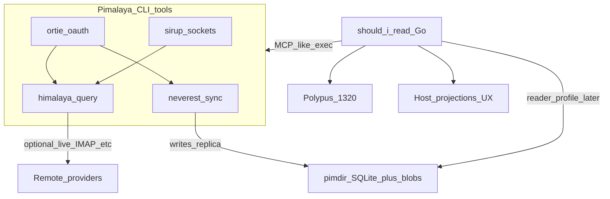

# Mail store architecture (draft)

Host-owned draft grounded in [INDEX.md](INDEX.md). EmailOps remains current custody only; see [emailops-ai-capabilities-roadmap.md](../emailops-ai-capabilities-roadmap.md).

## North star

## Locked decisions

1. **Canonical local store** = **pimdir** ([store/pimdir.md](store/pimdir.md)), not EmailOps SQLite and not Maildir as the product DB. Maildir/m2dir = migration via [m2m](apps/m2m.md) only.
2. **Ingest** = [neverest](apps/neverest.md) sync into pimdir (beta; `v0.x` breakage until v1).
3. **Orchestration** = Go host invokes allow-listed CLIs ([integration.md](integration.md)); no Rust FFI in v1.
4. **AI** = Polypus only (`POLYPUS_BASE_URL`, default `http://127.0.0.1:1320`); fail closed when `./scripts/check-polypus.sh` fails before AI work.
5. **Experience** = host projections, reports, and future UI over store + decisions; not Himalaya TUI and not an Outlook-style EmailOps clone.
6. **EmailOps** = optional experiment for sync/UI until a migration plan exists; not the architecture target.
7. **Unwanted mail** = report-only until [report-only-eval.md](../report-only-eval.md) passes; no auto trash/spam/mark-read in the first milestone.
8. **Gmail** = prefer IMAP or Himalaya-documented paths; do not assume Neverest Gmail backend or early `io-gmail` are production-ready ([apps/neverest.md](apps/neverest.md), [libs/io-gmail.md](libs/io-gmail.md)).

## Data flows

| Flow | Path |
|------|------|
| Sync | Remote (IMAP, …) → neverest → pimdir store on disk |
| Ad-hoc mail op | Host → himalaya `--json` → remote (when replica stale or op not in store API yet) |
| Auth refresh | Host or operator → ortie → token commands referenced in TOML |
| AI insight | Host reads store projection / export → Polypus chat/embeddings |
| Watch (later) | carillon hook → policy in host → neverest sync |

## Future Go glue (documented, not built here)

| Piece | Note |
|-------|------|
| Tool runner | Allow-list map → argv builder → JSON decoder |
| pimdir reader | `database/sql` + SQLite against STORAGE.md reader profile |
| Watch | Prefer **carillon** over retiring mirador |

## Related rules

- `.cursor/rules/architecture.mdc` (Polypus, EmailOps black box, report-only)
- `.cursor/rules/pimalaya-ecosystem.mdc` (load this index when designing mail layer)
