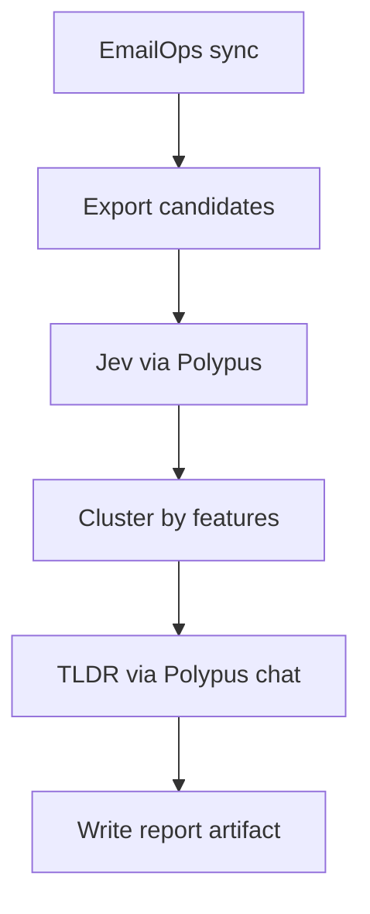

# Report-only unwanted mail evaluation

First milestone after Polypus wiring: classify and cluster unwanted mail, produce TLDRs, **do not mutate the mailbox**.

## Goal

Decide whether a Jev-backed filter is accurate enough to justify quarantine later. Done looks like a reproducible report: per-message decisions, cluster membership, and short cluster summaries, with no deletes, moves, or mark-read side effects.

## Roles

| Component | Owns | Does not own |
|-----------|------|--------------|
| EmailOps | Sync, local storage, CLI export of headers/bodies, existing junk heuristics | Direct Jev or OpenRouter calls |
| Polypus | All model HTTP (`/v1/*`), allow-lists, breakers | Mailbox semantics |
| Jev (later, via Polypus) | Typed decisions (noul / choice / score) for spam, phishing, newsletter, urgency | Free-form TLDR prose |
| Chat/summary model (via Polypus) | Cluster TLDR text | Binary keep/drop decisions |

## Pipeline (report only)



1. Sync mail with EmailOps (`emailops-cli sync`). Prefer a bounded sample (account + date window).
2. Export message ids, subject, from, list-id, and a truncated body into a host-owned artifact under `tmp/` (gitignored).
3. For each message, ask Jev (through Polypus) structured questions, for example:
   - `is_unwanted` (noul)
   - `category` (choice: legitimate, spam, phishing, newsletter, promo, other)
   - `urgency` (score)
4. Cluster high-`is_unwanted` messages by normalized sender domain and/or embedding similarity (embeddings also via Polypus). Assign `cluster_id`.
5. For each cluster, call a chat model through Polypus with representatives only; ask for a short TLDR (why unwanted, common senders, suggested future action).
6. Write `tmp/unwanted-report-<timestamp>.json` and a human-readable markdown summary. **No EmailOps trash/spam/delete API calls.**

## Output schema (minimum)

```json
{
  "mode": "report_only",
  "polypus_base_url": "http://127.0.0.1:1320",
  "messages": [
    {
      "id": "…",
      "cluster_id": "c1",
      "decisions": {
        "is_unwanted": 0.97,
        "category": "newsletter",
        "urgency": 0.1
      }
    }
  ],
  "clusters": [
    {
      "id": "c1",
      "size": 12,
      "tldr": "Weekly retail promos from the same ESP.",
      "suggested_action": "quarantine_candidate"
    }
  ]
}
```

## Thresholds (draft; tune after first run)

| Gate | Draft rule | Effect |
|------|------------|--------|
| Auto-flag for review | `is_unwanted >= 0.90` and `category ∈ {spam, phishing, newsletter, promo}` | Appears in report only |
| Hold for human | `0.70 <= is_unwanted < 0.90` | Separate "uncertain" section |
| Leave alone | `is_unwanted < 0.70` or `category = legitimate` | Omitted from unwanted clusters |
| Quarantine automation | Not allowed in this milestone | Requires explicit later approval |
| Permanent delete | Never in v1 | Out of scope |

## Explicit non-goals

- Moving messages to Spam or Trash
- Permanent deletion
- Marking messages read
- Training on full mailbox without a sampled window
- Calling TypeSafe / Jev from EmailOps without Polypus

## Exit criteria to unlock quarantine later

- Evaluation set of at least 100 labeled messages (human-checked)
- Precision on `is_unwanted` for the auto-flag band meets an agreed target (set after first report)
- Zero false-positive phishing misses on the eval set for the auto-flag band, or documented accepted risk
- Operator can reproduce the report from CLI with Polypus up and EmailOps synced

## Next implementation slice (after this docs milestone)

1. Land EmailOps OpenAI-compatible base URL → Polypus (nested repo).
2. Add a host report runner that reads CLI `--json` exports and writes the artifact above.
3. Wire Jev behind Polypus; keep EmailOps unaware of TypeSafe URLs.
