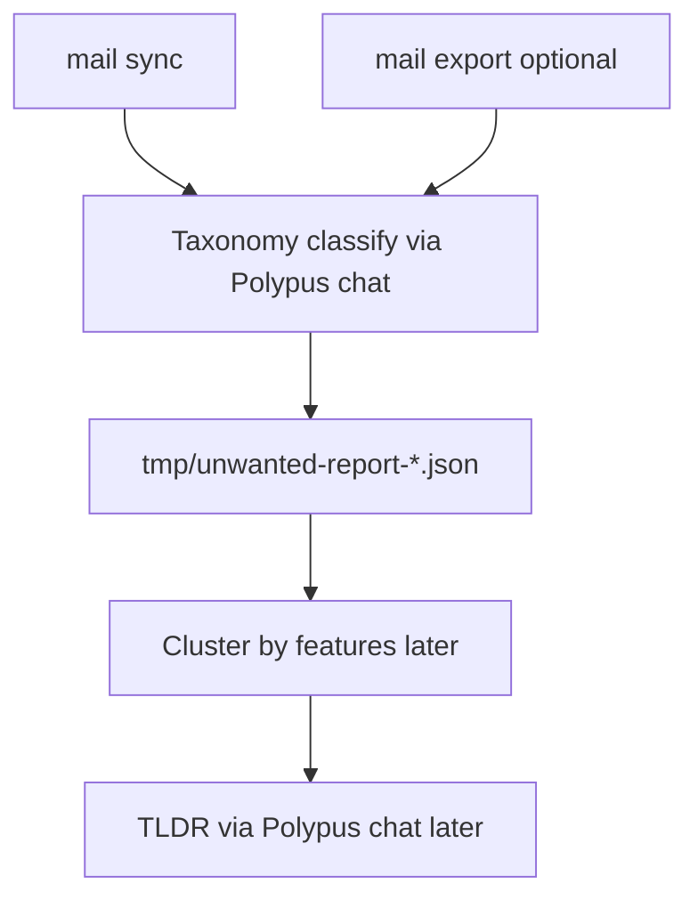

# Report-only unwanted mail evaluation

First milestone after Polypus wiring: classify and cluster unwanted mail, produce TLDRs, **do not mutate the mailbox**.

## Goal

Decide whether taxonomy-backed classification is accurate enough to justify quarantine later. Done looks like a reproducible report: per-message leaf assignments (and optional catalog aliases), then later cluster membership and short cluster summaries, with no deletes, moves, or mark-read side effects.

## Roles

| Component | Owns | Does not own |
|-----------|------|--------------|
| Host mail lane (Neverest + pimdir) | Sync, local storage, post-sync classify, mail export | Direct OpenRouter or TypeSafe calls |
| Polypus | All model HTTP (`/v1/*`), allow-lists, breakers | Mailbox semantics |
| Taxonomy harness (host seats) | Judge via Polypus SystemOne (JEV); Author via chat; catalog `inbox-mail` | Mailbox mutation |
| Chat/summary model (via Polypus, later) | Cluster TLDR text | Per-message leaf assignment (current slice) |

## Pipeline (report only)


```mermaid
flowchart TD
  sync[mail sync]
  classify[Taxonomy classify via Polypus chat]
  report[tmp/unwanted-report-*.json]
  export[mail export optional]
  cluster[Cluster by features later]
  tldr[TLDR via Polypus chat later]
  sync --> classify
  classify --> report
  export --> classify
  report --> cluster
  cluster --> tldr
```

1. Sync mail with `make sync`. After a successful fetch, the host classifies newly fetched unique messages (cap per `taxonomy.classify_max`; use `--no-classify` to skip). Polypus down after sync: replica stays; classify skipped; exit 0.
2. Resume or backfill with `make report` / `should-i-read mail report` (lists recent pimdir rows or reads `--in` export JSON). Requires Polypus up (fail closed).
3. For each message, taxonomy `Operate` walks the catalog (Judge SystemOne noul per sibling at each hop) then optional Author + gate through Polypus chat JSON. Report rows include `path` (branch ids to leaf). Accepted drafts update `~/.config/should-i-read/vocabularies/inbox-mail.yaml` unless `--no-apply`.
4. **Later:** cluster by sender domain and/or embeddings via Polypus; TLDR per cluster.
5. Write `tmp/unwanted-report-<timestamp>.json`. **No mailbox trash/spam/delete API calls.**

## Output schema (minimum)

```json
{
  "mode": "report_only",
  "polypus_base_url": "http://127.0.0.1:1320",
  "messages": [
    {
      "id": "…",
      "cluster_id": "c1",
      "decisions": {
        "is_unwanted": 0.97,
        "category": "newsletter",
        "urgency": 0.1
      }
    }
  ],
  "clusters": [
    {
      "id": "c1",
      "size": 12,
      "tldr": "Weekly retail promos from the same ESP.",
      "suggested_action": "quarantine_candidate"
    }
  ]
}
```

## Thresholds (draft; tune after first run)

| Gate | Draft rule | Effect |
|------|------------|--------|
| Auto-flag for review | `is_unwanted >= 0.90` and `category ∈ {spam, phishing, newsletter, promo}` | Appears in report only |
| Hold for human | `0.70 <= is_unwanted < 0.90` | Separate "uncertain" section |
| Leave alone | `is_unwanted < 0.70` or `category = legitimate` | Omitted from unwanted clusters |
| Quarantine automation | Not allowed in this milestone | Requires explicit later approval |
| Permanent delete | Never in v1 | Out of scope |

## Explicit non-goals

- Moving messages to Spam or Trash
- Permanent deletion
- Marking messages read
- Training on full mailbox without a sampled window
- Calling TypeSafe / Jev without Polypus

## Exit criteria to unlock quarantine later

- Evaluation set of at least 100 labeled messages (human-checked)
- Precision on `is_unwanted` for the auto-flag band meets an agreed target (set after first report)
- Zero false-positive phishing misses on the eval set for the auto-flag band, or documented accepted risk
- Operator can reproduce the report from CLI with Polypus up and mail synced

## Shipped slice (taxonomy v0.1.1)

- Post-sync classify on fetch hunks; `mail report` for resume/backfill.
- Strop `JobRunner` generator `mail_classify` wraps taxonomy `Operate`; Polypus HTTP only inside Judge/Author seats.
- Artifacts: `tmp/unwanted-report-*.json`, progress `tmp/mail-classify-progress.json`.

## Next implementation slice

1. Clustering + cluster TLDR via Polypus embeddings and chat.
2. Tune eval thresholds against labeled samples (schema below is aspirational for clustering).
